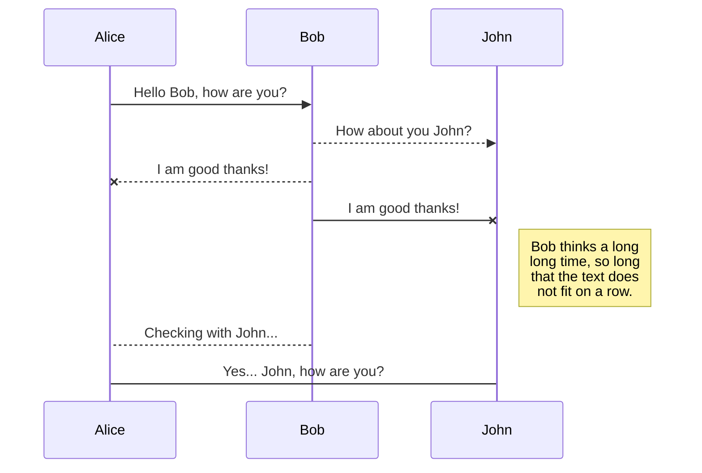

# Markdown编辑器基本功能
## Bold 加粗
语法： `**` 加粗部分`**`
**快捷键**: Ctrl + B 或 顶端工具栏 `B`

## Italic 斜体
语法： `*` 斜体部分`*`
*快捷键*  Ctrl + I 或者 顶端工具栏 `I`


## Strikethrough 删除线
语法： `~~` 删除部分`~~`  或者顶端 工具栏 ~~T~~
如 ~~Strikethrough 删除线~~

## Headers 标题
1-6级 #  或者顶端工具栏 `H#`
## 2
### 3

## Subscript 下标
语法： `~` 下标部分`~`   或者顶端工具栏  X~2~
如  X~2~

## Superscript 上标

语法： `^` 上标部分`^`   或者顶端工具栏  X^2^
如  X^2^

## Blockquotes 引用块

语法：在每行文本前使用大于号，后跟空格。
通过在blockquote后面的单独一行中添加一个类，您可以更改blockquote的外观。
请注意，这些样式是Wiki.js特有的，在其他应用程序中会退回到标准的blockquote样式。
>This is a default unstyled blockquote.

> .This is a {.is-info} blockquote.
{.is-info}

> .This is a {.is-success} blockquote.
{.is-success}

> .This is a {.is-warning} blockquote.
{.is-warning}

> .This is a {.is-danger} blockquote.
{.is-danger}


## Unordered Lists 无序列表
分三种
### 第一种 默认样式：
- list01, 也可以用 *  替代 -
- list02

### 第二种 `{.grid-list}` 样式：
- Grid Item 1 
- Grid Item 2
- Grid Item 3
{.grid-list}

### 第三种 `{.links-list}` 链接样式：
- [SFCS *Subtitle description here*](/en/sfcs)
- [Consectetur adipiscing elit *Another subtitle description here*](https://www.google.com)
- [Morbi vehicula aliquam *Third subtitle description here*](https://www.google.com)
{.links-list}

> 请注意，这些样式是特定于Wiki.js，在其他应用程序中将回退到标准列表样式
{.is-info}


## Ordered Lists 有序列表

1. Lorem ipsum dolor sit amet

1. Consectetur adipiscing elit

1. Morbi vehicula aliquam
> 虽然您可以按数字顺序为每行编号，但在每行上使用数字1更容易。最终结果将自动递增。这样，在以后添加或删除一行时，您就不需要对每一行重新编号
{.is-info}

## Inline Code 内联代码 和 Code Blocks 代码块
语法：在文本选择前后使用`反勾号` 或者顶端的工具栏 `<>`  `Inline Code `

```markdown
Lorem `ipsum` dolor
- Code Blocks 代码块
```

## Keyboard Keys 键盘按键
语法： `<kbd>`按键部分`/kbd>`  或 选中后，点击顶端工具栏的键盘小图标
如 <kbd>CTRL</kbd> + <kbd>C</kbd>

## Horizontal Line 水平分割线
语法：`---`
---

# 编辑器其他功能
## Content Tabs 内容表
使用标题和添加`{.tabset}`类的父标题。父标题文本不会显示在最终结果中。
> 请注意，您可以使用任何头级别，只要子头级别更高。例如，如果父标题是### (h3)，那么子标题必须是#### # (h4)。父标题的最大标题级别为5，子标题为6
{.is-info}
## Tabs {.tabset}
### First Tab
Any content here will go into the first tab...
### Second Tab
Any content here will go into the second tab...
### Third Tab
Any content here will go into the third tab...


## Emojis 表情符号

语法：`:identifier:`
如 :apple:, :fire:
请参阅表情图备忘表： [Emoji Cheat Sheet](https://www.webfx.com/tools/emoji-cheat-sheet/) 

## Images 图片
语法： ``. 或者UI操作：左边工具栏的 **Assets** 工具。

```markdown


Consectetur  elit
```

有时图像太大，或者您希望图像填满所有可用空间。
- 在图像路径末尾加上尺寸，格式如下
```Markdown

```
- 也可以省略其中一个值，以自动保持图像比率：
  ```markdown
  
  
  ```
- 也可以使用其他单位，比如**%**。当需要图像占用所有可用空间时非常有用：
```markdown

```
### asset 图片的对齐方式:
```markdown
None

Left: `{.align-left}` 
{.align-left}
Centered: `{.align-center}`
{.align-center}
Right: `{.align-right}`
{.align-right}
Absolute Top Right `{.align-abstopright}`
{.align-abstopright}
```

## Footnotes 脚注
This sentence[^1] needs a few footnotes.[^2]
[^1]: A string of syntactic words.
[^2]: A useful example sentence.

## Task Lists 任务列表
语法： `- [ ]` or  `- [x]`.
- [x] Checked task item
- [x] Another checked task item
- [ ] Unchecked task item

## Mermaid Diagrams
**暂时没有使用的打算。**
Mermaid是一种简单的类似 Markdown 的脚本语言，通过 JavaScript 编程语言，将文本转换为图片。
Mermaid 支持绘制非常多种类的图，常见的有时序图、流程图、类图、甘特图等等


## PlantUML Diagrams
**暂时没有使用的打算。**
PlantUML是一个快速创建UML图形的组件。
```plantuml
Bob->Alice : hello
```

