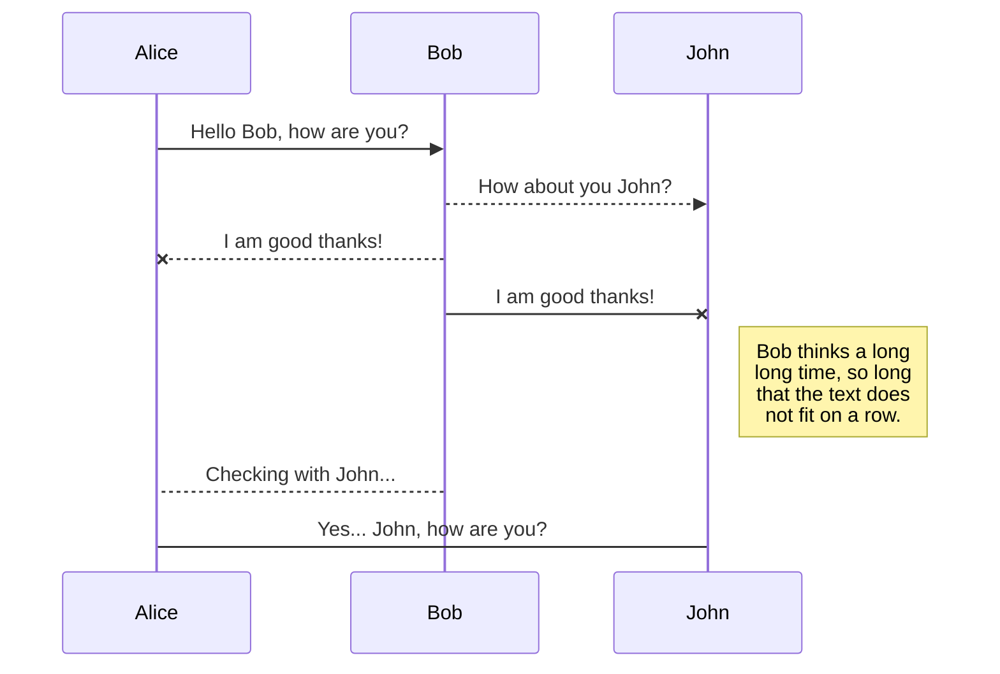

# Markdown编辑器基本功能
## Bold 加粗
语法： `**` 加粗部分`**`
**快捷键**: Ctrl + B 或 顶端工具栏 `B`

## Italic 斜体
语法： `*` 斜体部分`*`
*快捷键*  Ctrl + I 或者 顶端工具栏 `I`


## Strikethrough 删除线
语法： `~~` 删除部分`~~`  或者顶端 工具栏 ~~T~~
如 ~~Strikethrough 删除线~~

## Headers 标题
1-6级 #  或者顶端工具栏 `H#`
## 2
### 3

## Subscript 下标
语法： `~` 下标部分`~`   或者顶端工具栏  X~2~
如  X~2~

## Superscript 上标

语法： `^` 上标部分`^`   或者顶端工具栏  X^2^
如  X^2^

## Blockquotes 引用块

语法：在每行文本前使用大于号，后跟空格。
通过在blockquote后面的单独一行中添加一个类，您可以更改blockquote的外观。
请注意，这些样式是Wiki.js特有的，在其他应用程序中会退回到标准的blockquote样式。
>This is a default unstyled blockquote.

> .This is a {.is-info} blockquote.
{.is-info}

> .This is a {.is-success} blockquote.
{.is-success}

> .This is a {.is-warning} blockquote.
{.is-warning}

> .This is a {.is-danger} blockquote.
{.is-danger}


## Unordered Lists 无序列表
分三种
### 第一种 默认样式：
- list01, 也可以用 *  替代 -
- list02

### 第二种 `{.grid-list}` 样式：
- Grid Item 1 
- Grid Item 2
- Grid Item 3
{.grid-list}

### 第三种 `{.links-list}` 链接样式：
- [SFCS *Subtitle description here*](/en/sfcs)
- [Consectetur adipiscing elit *Another subtitle description here*](https://www.google.com)
- [Morbi vehicula aliquam *Third subtitle description here*](https://www.google.com)
{.links-list}

> 请注意，这些样式是特定于Wiki.js，在其他应用程序中将回退到标准列表样式
{.is-info}


## Ordered Lists 有序列表

1. Lorem ipsum dolor sit amet

1. Consectetur adipiscing elit

1. Morbi vehicula aliquam
> 虽然您可以按数字顺序为每行编号，但在每行上使用数字1更容易。最终结果将自动递增。这样，在以后添加或删除一行时，您就不需要对每一行重新编号
{.is-info}

## Inline Code 内联代码 和 Code Blocks 代码块
语法：在文本选择前后使用`反勾号` 或者顶端的工具栏 `<>`  `Inline Code `

```markdown
Lorem `ipsum` dolor
- Code Blocks 代码块
```

## Keyboard Keys 键盘按键
语法： `<kbd>`按键部分`/kbd>`  或 选中后，点击顶端工具栏的键盘小图标
如 <kbd>CTRL</kbd> + <kbd>C</kbd>

## Horizontal Line 水平分割线
---

# 编辑器其他功能
## Content Tabs 内容表
使用标题和添加`{.tabset}`类的父标题。父标题文本不会显示在最终结果中。
> 请注意，您可以使用任何头级别，只要子头级别更高。例如，如果父标题是### (h3)，那么子标题必须是#### # (h4)。父标题的最大标题级别为5，子标题为6
{.is-info}
## Tabs {.tabset}
### First Tab
Any content here will go into the first tab...
### Second Tab
Any content here will go into the second tab...
### Third Tab
Any content here will go into the third tab...


## Emojis 表情符号

语法：`:identifier:`
如 :apple:, :fire:
请参阅表情图备忘表： [Emoji Cheat Sheet](https://www.webfx.com/tools/emoji-cheat-sheet/) 

## Images 图片
语法： ``. 或者UI操作：左边工具栏的 **Assets** 工具。

```markdown


Consectetur  elit
```

有时图像太大，或者您希望图像填满所有可用空间。
- 在图像路径末尾加上尺寸，格式如下
```Markdown

```
- 也可以省略其中一个值，以自动保持图像比率：
  ```markdown
  
  
  ```
- 也可以使用其他单位，比如**%**。当需要图像占用所有可用空间时非常有用：
```markdown

```
### asset 图片的对齐方式:
```markdown
None

Left: `{.align-left}` 
{.align-left}
Centered: `{.align-center}`
{.align-center}
Right: `{.align-right}`
{.align-right}
Absolute Top Right `{.align-abstopright}`
{.align-abstopright}
```

## Footnotes 脚注
This sentence[^1] needs a few footnotes.[^2]
[^1]: A string of syntactic words.
[^2]: A useful example sentence.

## Task Lists 任务列表
语法： `- [ ]` or  `- [x]`.
- [x] Checked task item
- [x] Another checked task item
- [ ] Unchecked task item

## Mermaid Diagrams
**暂时没有使用的打算。**
Mermaid是一种简单的类似 Markdown 的脚本语言，通过 JavaScript 编程语言，将文本转换为图片。
Mermaid 支持绘制非常多种类的图，常见的有时序图、流程图、类图、甘特图等等


## PlantUML Diagrams
**暂时没有使用的打算。**
PlantUML是一个快速创建UML图形的组件。
```plantuml
Bob->Alice : hello
```
# Media Assets 媒体资产
上传，使用（对齐方式），管理--- 以QAS 中的MAPACK001为例
对齐方式：
 None
   
Left: `{.align-left}` 
   {.align-left}
Centered: `{.align-center}`
   {.align-center}
Right: `{.align-right}`
   {.align-right}
Absolute Top Right `{.align-abstopright}`
   {.align-abstopright}

---

# 其他注意事项或小技巧

 1. 可以跳转定位到页面中某个标题：如跳转到某个页面的Reference一级标题：`../mapack001#reference`
[go to mapack001 reference title](/sfcs/modules/packing/mapack001#reference)

2. 表格的处理：若直接从Excel中Copy到Wik.js,不会自动识别；建议的Copy顺序: Excel -->Typora -->Wiki.js


3. 在线Draw IO 画图工具中，其文字描述中不能出现``回车换行键``，否则显示不出来
```diagram
PHN2ZyB4bWxucz0iaHR0cDovL3d3dy53My5vcmcvMjAwMC9zdmciIHhtbG5zOnhsaW5rPSJodHRwOi8vd3d3LnczLm9yZy8xOTk5L3hsaW5rIiB2ZXJzaW9uPSIxLjEiIHdpZHRoPSIxMjFweCIgaGVpZ2h0PSIxMDFweCIgdmlld0JveD0iLTAuNSAtMC41IDEyMSAxMDEiIGNvbnRlbnQ9IiZsdDtteGZpbGUgaG9zdD0mcXVvdDtlbWJlZC5kaWFncmFtcy5uZXQmcXVvdDsgbW9kaWZpZWQ9JnF1b3Q7MjAyMC0xMC0yN1QwMTo0NjoxNS44NjlaJnF1b3Q7IGFnZW50PSZxdW90OzUuMCAoV2luZG93cyBOVCAxMC4wOyBXaW42NDsgeDY0KSBBcHBsZVdlYktpdC81MzcuMzYgKEtIVE1MLCBsaWtlIEdlY2tvKSBDaHJvbWUvNzMuMC4zNjgzLjg2IFNhZmFyaS81MzcuMzYmcXVvdDsgdmVyc2lvbj0mcXVvdDsxMy43LjUmcXVvdDsgZXRhZz0mcXVvdDtIdk1ITm9CeW1jUlhvYUZPVUZ2aSZxdW90OyB0eXBlPSZxdW90O2VtYmVkJnF1b3Q7Jmd0OyZsdDtkaWFncmFtIGlkPSZxdW90OzRoUDg5Y2VuVzc3SWdDS3doZlZCJnF1b3Q7IG5hbWU9JnF1b3Q7UGFnZS0xJnF1b3Q7Jmd0O3JaUk5jNE1nRUVCL2pmY29DVFhYMnJTOTlKVE85RXhnRVNZb0RtSTEvZlhGZ0Y5ak10UE81T0xnMjExaEh6dEdLQ3U2TjBNcThhRVpxQ2pac0M1Q0wxR1NwTHZZUFh0dzhXQ2JiajNJaldRZXhSTTR5aDhJY0JOb0l4blVpMFNydGJLeVdrS3F5eEtvWFRCaWpHNlhhVnlyNWE0VnlXRUZqcFNvTmYyU3pJclFWdkkwOFhlUXVSaDJqdkhlUndveUpJZE9ha0dZYm1jSUhTS1VHYTJ0WHhWZEJxcDNOM2p4ZGE5M291UEJESlQyTHdXSkwvZ21xZ205ZlVKdHc5bnNaV2pZNktaazBOZkVFWHB1aGJSd3JBanRvNjI3WWNlRUxWUUljNmxVcHBVMjExckVDS1NjT2w1Ym84OHdpMkNhd29tN1NEZ0VHQXZkM1ViaVVZOGJLOUFGV0hOeEthRUE3WUxSTUZLajRYYTZvSGhnWW5ZNU9EQVNaaUlmUHoxcGM0dGc3clpGdExKSVRwUUJ6NFhNencrVnlUbFA2RTJaREovd0RqOUlKa1pMbWZ1MXpQMTI3Ukw5MzZWN25hYjlHcHY5TXREaEZ3PT0mbHQ7L2RpYWdyYW0mZ3Q7Jmx0Oy9teGZpbGUmZ3Q7Ij48ZGVmcy8+PGc+PHJlY3QgeD0iMCIgeT0iMCIgd2lkdGg9IjEyMCIgaGVpZ2h0PSI2MCIgcng9IjkiIHJ5PSI5IiBmaWxsPSIjZGFlOGZjIiBzdHJva2U9IiM2YzhlYmYiIHBvaW50ZXItZXZlbnRzPSJhbGwiLz48ZyB0cmFuc2Zvcm09InRyYW5zbGF0ZSgtMC41IC0wLjUpIj48c3dpdGNoPjxmb3JlaWduT2JqZWN0IHN0eWxlPSJvdmVyZmxvdzogdmlzaWJsZTsgdGV4dC1hbGlnbjogbGVmdDsiIHBvaW50ZXItZXZlbnRzPSJub25lIiB3aWR0aD0iMTAwJSIgaGVpZ2h0PSIxMDAlIiByZXF1aXJlZEZlYXR1cmVzPSJodHRwOi8vd3d3LnczLm9yZy9UUi9TVkcxMS9mZWF0dXJlI0V4dGVuc2liaWxpdHkiPjxkaXYgeG1sbnM9Imh0dHA6Ly93d3cudzMub3JnLzE5OTkveGh0bWwiIHN0eWxlPSJkaXNwbGF5OiBmbGV4OyBhbGlnbi1pdGVtczogdW5zYWZlIGNlbnRlcjsganVzdGlmeS1jb250ZW50OiB1bnNhZmUgY2VudGVyOyB3aWR0aDogMTE4cHg7IGhlaWdodDogMXB4OyBwYWRkaW5nLXRvcDogMzBweDsgbWFyZ2luLWxlZnQ6IDFweDsiPjxkaXYgc3R5bGU9ImJveC1zaXppbmc6IGJvcmRlci1ib3g7IGZvbnQtc2l6ZTogMDsgdGV4dC1hbGlnbjogY2VudGVyOyAiPjxkaXYgc3R5bGU9ImRpc3BsYXk6IGlubGluZS1ibG9jazsgZm9udC1zaXplOiAxMnB4OyBmb250LWZhbWlseTogSGVsdmV0aWNhOyBjb2xvcjogIzAwMDAwMDsgbGluZS1oZWlnaHQ6IDEuMjsgcG9pbnRlci1ldmVudHM6IGFsbDsgd2hpdGUtc3BhY2U6IG5vcm1hbDsgd29yZC13cmFwOiBub3JtYWw7ICI+VGVzdDwvZGl2PjwvZGl2PjwvZGl2PjwvZm9yZWlnbk9iamVjdD48dGV4dCB4PSI2MCIgeT0iMzQiIGZpbGw9IiMwMDAwMDAiIGZvbnQtZmFtaWx5PSJIZWx2ZXRpY2EiIGZvbnQtc2l6ZT0iMTJweCIgdGV4dC1hbmNob3I9Im1pZGRsZSI+VGVzdDwvdGV4dD48L3N3aXRjaD48L2c+PHJlY3QgeD0iMTMiIHk9IjcwIiB3aWR0aD0iOTQiIGhlaWdodD0iMzAiIHJ4PSI0LjUiIHJ5PSI0LjUiIGZpbGw9IiNmZmYyY2MiIHN0cm9rZT0iI2Q2YjY1NiIgcG9pbnRlci1ldmVudHM9ImFsbCIvPjxnIHRyYW5zZm9ybT0idHJhbnNsYXRlKC0wLjUgLTAuNSkiPjxzd2l0Y2g+PGZvcmVpZ25PYmplY3Qgc3R5bGU9Im92ZXJmbG93OiB2aXNpYmxlOyB0ZXh0LWFsaWduOiBsZWZ0OyIgcG9pbnRlci1ldmVudHM9Im5vbmUiIHdpZHRoPSIxMDAlIiBoZWlnaHQ9IjEwMCUiIHJlcXVpcmVkRmVhdHVyZXM9Imh0dHA6Ly93d3cudzMub3JnL1RSL1NWRzExL2ZlYXR1cmUjRXh0ZW5zaWJpbGl0eSI+PGRpdiB4bWxucz0iaHR0cDovL3d3dy53My5vcmcvMTk5OS94aHRtbCIgc3R5bGU9ImRpc3BsYXk6IGZsZXg7IGFsaWduLWl0ZW1zOiB1bnNhZmUgY2VudGVyOyBqdXN0aWZ5LWNvbnRlbnQ6IHVuc2FmZSBjZW50ZXI7IHdpZHRoOiA5MnB4OyBoZWlnaHQ6IDFweDsgcGFkZGluZy10b3A6IDg1cHg7IG1hcmdpbi1sZWZ0OiAxNHB4OyI+PGRpdiBzdHlsZT0iYm94LXNpemluZzogYm9yZGVyLWJveDsgZm9udC1zaXplOiAwOyB0ZXh0LWFsaWduOiBjZW50ZXI7ICI+PGRpdiBzdHlsZT0iZGlzcGxheTogaW5saW5lLWJsb2NrOyBmb250LXNpemU6IDEycHg7IGZvbnQtZmFtaWx5OiBIZWx2ZXRpY2E7IGNvbG9yOiAjMDAwMDAwOyBsaW5lLWhlaWdodDogMS4yOyBwb2ludGVyLWV2ZW50czogYWxsOyB3aGl0ZS1zcGFjZTogbm9ybWFsOyB3b3JkLXdyYXA6IG5vcm1hbDsgIj5hYmNkZWZnaGlnazwvZGl2PjwvZGl2PjwvZGl2PjwvZm9yZWlnbk9iamVjdD48dGV4dCB4PSI2MCIgeT0iODkiIGZpbGw9IiMwMDAwMDAiIGZvbnQtZmFtaWx5PSJIZWx2ZXRpY2EiIGZvbnQtc2l6ZT0iMTJweCIgdGV4dC1hbmNob3I9Im1pZGRsZSI+YWJjZGVmZ2hpZ2s8L3RleHQ+PC9zd2l0Y2g+PC9nPjwvZz48c3dpdGNoPjxnIHJlcXVpcmVkRmVhdHVyZXM9Imh0dHA6Ly93d3cudzMub3JnL1RSL1NWRzExL2ZlYXR1cmUjRXh0ZW5zaWJpbGl0eSIvPjxhIHRyYW5zZm9ybT0idHJhbnNsYXRlKDAsLTUpIiB4bGluazpocmVmPSJodHRwczovL2Rlc2suZHJhdy5pby9zdXBwb3J0L3NvbHV0aW9ucy9hcnRpY2xlcy8xNjAwMDA0MjQ4NyIgdGFyZ2V0PSJfYmxhbmsiPjx0ZXh0IHRleHQtYW5jaG9yPSJtaWRkbGUiIGZvbnQtc2l6ZT0iMTBweCIgeD0iNTAlIiB5PSIxMDAlIj5WaWV3ZXIgZG9lcyBub3Qgc3VwcG9ydCBmdWxsIFNWRyAxLjE8L3RleHQ+PC9hPjwvc3dpdGNoPjwvc3ZnPg==
```


